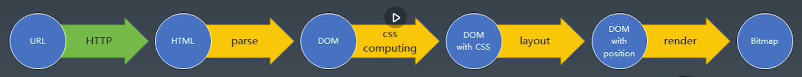

# 一、浏览器工作原理总结

+ 从URL到Bitmap的简过程
+ 我们看到的页面是一张图片，专业说法叫做位图（Bitmap），然后经过显卡（硬件）转换为我们可以识别的光信号显示在光屏上。
+  输入URL，通过http发送请求到服务器 -> 服务器返回 HTML，浏览器解析 HTML -> 构建 DOM 树 -> 计算 CSS 属性，得到含有样式的DOm树 -> 排版，渲染成位图 -> 通过硬件完成视图的显示


# 二、post四种编码格式
 
### 1. application/x-www-form-urlencoded
+ 最常见的表单数据类型，编码后以  ```key=value&```  的形式
+ 形如 ```Object.keys(this.body).map(key => `${key}=${encodeURIComponent(this.body[key])}`).join('&')```
+ encodeURIComponent()：因为在作用与url当作参数传递的时候，如参数出现空格这样的特殊字段，后台只可以读取到空格前的内容，后面内容丢失，造成数据读取失败，但是如果用encodeURIComponent()包裹一下，那会将这些特殊字符进行转义，这样后台就可以成功读取了，所以encodeURIComponent()用于url作为参数传递的场景中使用

### 2. application/json
可直接使用JSON.stringify进行转换

### 3. multipart/form-data

### 4. html/text
普通的文本或者String形式


